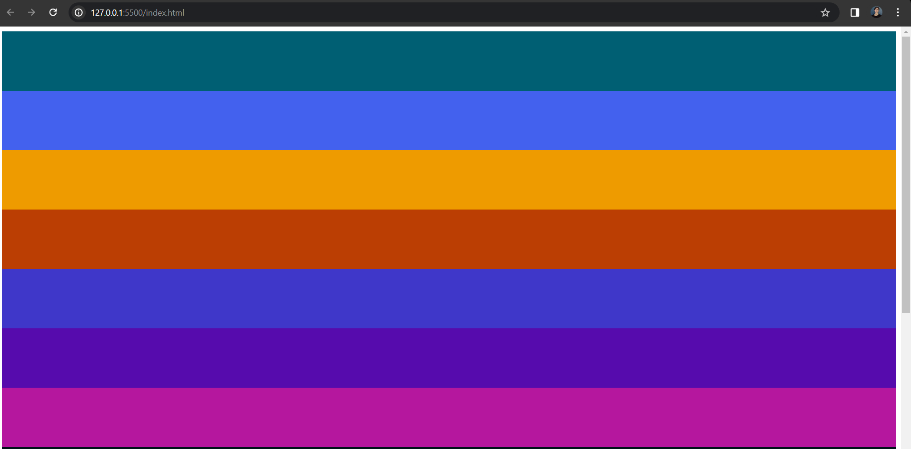
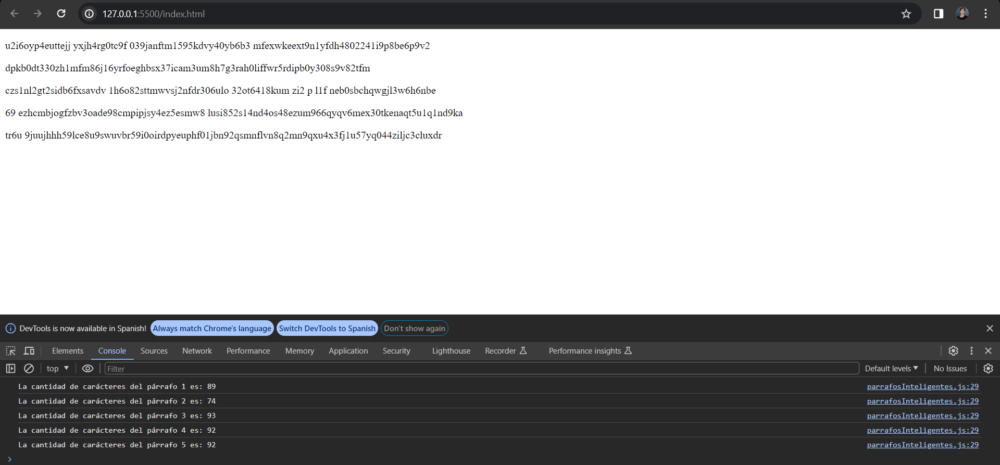

<!--González Navarro Oscar Eduardo 4SA-->

<!--archivo markdown para la documentación de mis scripts-->

# Laboratorio 01 Bloque 02

Archivos incluidos para el desarrollo de la practica:

* index.html
* Script01/contenedores.js
* Script02/contenedores1.2.js
* Script03/parrafosInteligentes.js
* README.md 

Ahora bien, este documento es creado para brindar una explicación detallada de cada uno de los scripts que se realizaron, con el objetivo de informar y retroalimentar el conocimiento adquirido y aplicado.

## Index
Sobre el index no hay mucho que decir, solo se creó y se conectará a cada script para su prueba según sea necesario

```html
<!DOCTYPE html>

<!--González Navarro Oscar Eduardo 4SA-->
<html lang="es">

<head>

    <meta charset="UTF-8">

    <meta name="viewport" content="width=device-width, initial-scale=1.0">

    <script defer src="Script01/script01.js"></script>

    <title>LAB01 B2</title>

</head>

<body>


</body>

</html>
```


## Contenedores (Script 01)
**Para el primer script realizado, las instrucciones son:**

Elaborar un script que genere 10 contenedores de
tamaño 100 y les agregue un color aleatorio.

---

Lo primero que se realiza es la referencia del body, es decir, crear un elemento body que referencie al body del html

```javascript
//Referenciamos el body
const body = document.querySelector('body')

//Arreglo de colores para que sea aleatorio
const colores =['#F72585','#B5179E','#7209B7','#560BAD','#480CA8','#3A0CA3','#3F37C9','#4361EE','#4895EF','#4CC9F0']
```

Posteriormente, se crea el arreglo de colores para que luego, al asignarlos a cada div, podamos tener una amplia selección de forma aleatoria

---

Luego, Solo falta crear el bucle encargado de crear los divs, modificar su tamaño, y asignarles colores del arreglo, para finalmente, agregarlos al body.

```javascript
//Bucle para crear los 10 divs
for (let i=0;i<=10 ; i++){

    //Se crea el div
    const div = document.createElement('div')

    //Se le modifica el tamaño
    div.style.height = '100px'

    //Se le modifica el color de forma aleatoria según nuestro arreglo de colores
    div.style.backgroundColor = colores[Math.floor(Math.random()*colores.length)]

    //Se conecta con el body
    body.appendChild(div)

}
```
Resultado obtenido:


## Contenedores 1.2 (Script 02)
**Para el segundo script realizado, las instrucciones son:**

Usando el script anterior agrega la funcionalidad de
que los colores no se repitan.

---

Lo primero  que se realiza es referenciar el body, y además crear nuestros arreglos, el primero que contiene 20 colores distintos, el segundo para almacenar los colores utilizados, y el último para almacenar los colores que resten.

```javascript
//Referenciamos el body
const body = document.querySelector('body')

//Arreglo de colores para que sea aleatorio (20 colores en esta ocasión)
const colores = ['#F72585','#B5179E','#7209B7','#560BAD','#480CA8','#3A0CA3','#3F37C9','#4361EE','#4895EF','#4CC9F0',
'#001219','#005F73','#0A9396','#94D2BD','#E9D8A6','#EE9B00','#CA6702','#BB3E03','#AE2012','#9B2226']

//Ahora bien, es necesario utilizar un arreglo nuevo, para almacenar los colores que ya se utilizaron
const coloresUtilizados = []

//Finalmente necesitamos un último arreglo para almacenar los colores restantes
const coloresRestantes = []

```

---

Posteriormente, realizamos el bucle encargado de realizar la selección de un color, agregarlo al arreglo de colores utilizados, y reescribir el arreglo de colores disponibles, para así finalmente, cambiar el color de los divs

```javascript
//Bucle para crear los 10 divs
for (let i=0;i<=10 ; i++){

    //Se crea el div
    const div = document.createElement('div')

    //Se le modifica el tamaño
    div.style.height = '100px'

    //Al arreglo de colores restantes, se le asignarán los valores restantes exceptuando al utilizado
    const coloresRestantes = colores.filter(color => !coloresUtilizados.includes(color));

    //Seleccionamos el color para el div
    const colorSeleccionado = coloresRestantes[Math.floor(Math.random() * coloresRestantes.length)];

    //Después de ello, agregamos ese color al arreglo de colores usados
    coloresUtilizados.push(colorSeleccionado);

    //finalmente modificamos el color de los divs
    div.style.backgroundColor = colorSeleccionado

    //Se conecta con el body
    body.appendChild(div)

}
```

Resultados obtenidos:




## Párrafos inteligentes (Script 03)
**Para el tercer script realizado, las instrucciones son:**

Elabora un script que sea capaz de generar 5
párrafos.

---

Lo primero es referenciar el body

```javascript
//Referenciamos el body
const body = document.querySelector('body')
```

---

Posteriormente,realizamos el bucle encargado de crear los 5 párafos, llamar al método que los llena, y mostrar la cantidad de de carácteres de los mismos.

```javascript
//Bucle para crear los 5 párrafos
for (let i=0;i < 5 ; i++){

    //Se crea el párrafo
    const parrafo = document.createElement('p')

    //Variable para almacenar el total de caracteres por párrafo
    totalCaracteres = 0

    //Seleccionamos un número aleatorio entre 50 y 100 para las palabras
    let numPalabsAlea = Math.floor(Math.random() * 51) + 50

    //Se almacena en una variable lo que regrese la función
    let contenido = llenarParrafos(numPalabsAlea)

    //Se asigna el contenido obtenido al texto del parrafo
    parrafo.innerText = contenido

    //Se agregan y muestran la cantidad de carácteres de cada párrafo
    totalCaracteres += contenido.length

    console.log('La cantidad de carácteres del párrafo ' + [i + 1] + ' es: ' + totalCaracteres)

    //Se conecta con el body
    body.appendChild(parrafo)

}
```

---

Y finalmente, hacemos el método encargado de llenar los párrafos.

```javascript
//Función encargada de llenar los párrafos
function llenarParrafos(numPalabsAlea){
    
    //Cadena de carácteres para usar
    let caracteres = 'abcdefghijklmnopqrstuvwxyz0123456789 '
    //Variable para almacenar el texto
    let texto = ''

    //Bucle para agregar carácteres al texto
    for (let i = 0; i < numPalabsAlea; i++) {
      texto += caracteres.charAt(Math.floor(Math.random() * caracteres.length))
    }
    return texto
}
```

Resultados obtenidos:

