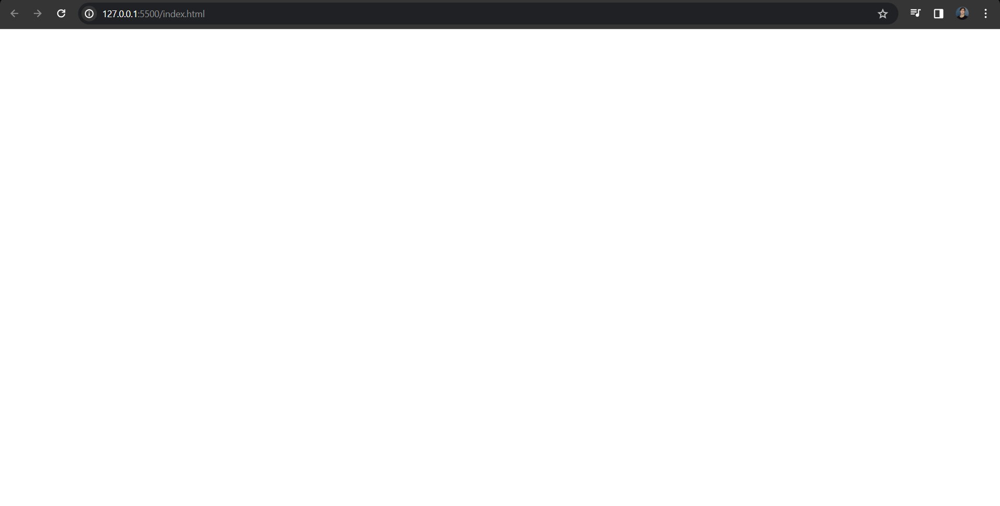
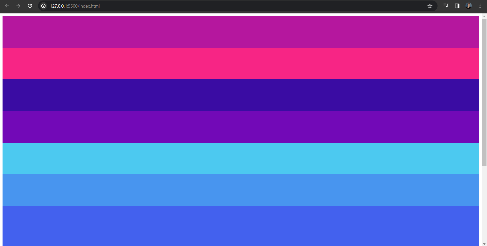

<!--González Navarro Oscar Eduardo 4SA-->

<!--archivo markdown para la documentación de mis scripts-->

# Laboratorio 01 Bloque 02

Archivos incluidos para el desarrollo de la practica:

* index.html
* script01.js
* script02.js
* script03.js
* README.md 

Ahora bien, este documento es creado para brindar una explicación detallada de cada uno de los scripts que se realizaron, con el objetivo de informar y retroalimentar el conocimiento adquirido y aplicado.

## Index
Sobre el index no hay mucho que decir, solo se creó y se conectará a cada script para su prueba según sea necesario

```html
<!DOCTYPE html>

<!--González Navarro Oscar Eduardo 4SA-->
<html lang="es">

<head>

    <meta charset="UTF-8">

    <meta name="viewport" content="width=device-width, initial-scale=1.0">

    <script defer src="Script01/script01.js"></script>

    <title>LAB01 B2</title>

</head>

<body>


</body>

</html>
```



## Script 01
**Para el primer script realizado, las instrucciones son:**

Elaborar un script que genere 10 contenedores de
tamaño 100 y les agregue un color aleatorio.

---

Lo primero que se realiza es la referencia del body, es decir, crear un elemento body que referencie al body del html

```javascript
//Referenciamos el body
const body = document.querySelector('body')

//Arreglo de colores para que sea aleatorio
const colores =['#F72585','#B5179E','#7209B7','#560BAD','#480CA8','#3A0CA3','#3F37C9','#4361EE','#4895EF','#4CC9F0']
```

Posteriormente, se crea el arreglo de colores para que luego, al asignarlos a cada div, podamos tener una amplia selección de forma aleatoria

---

Luego, Solo falta crear el bucle encargado de crear los divs, modificar su tamaño, y asignarles colores del arreglo, para finalmente, agregarlos al body.

```javascript
//Bucle para crear los 10 divs
for (let i=0;i<=10 ; i++){

    //Se crea el div
    const div = document.createElement('div')

    //Se le modifica el tamaño
    div.style.height = '100px'

    //Se le modifica el color de forma aleatoria según nuestro arreglo de colores
    div.style.backgroundColor = colores[Math.floor(Math.random()*colores.length)]

    //Se conecta con el body
    body.appendChild(div)

}
```
Resultado obtenido:



## Script 02
